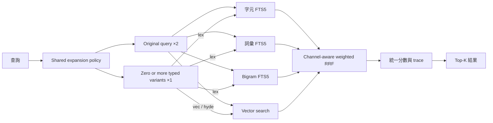
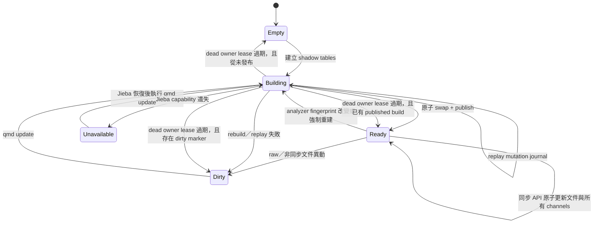
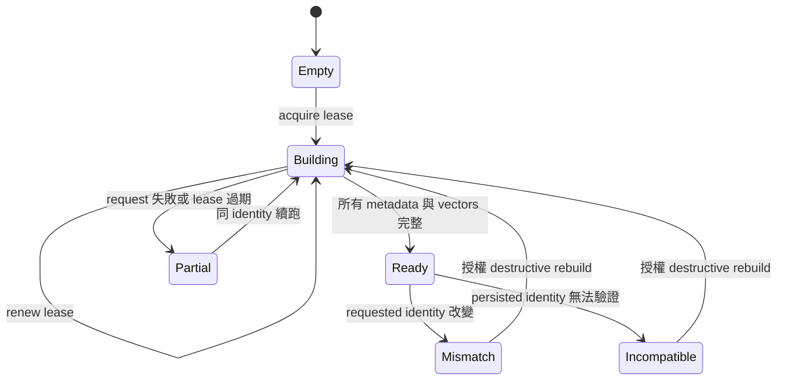
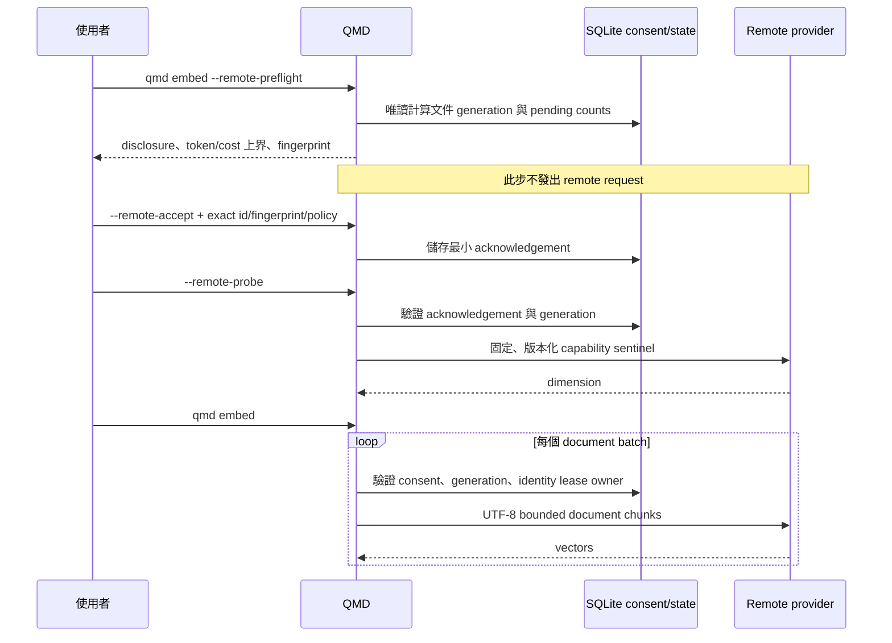

# QMD CJK 搜尋與 Embedding 架構

本文件說明 QMD 的 CJK lexical pipeline、embedding identity state machine，以及 remote embedding 的資料揭露邊界。它描述目前實作，不是未來提案。

## 搜尋資料流

- 字元、詞彙與 bigram 是獨立 lexical channel，不會把不同分數尺度直接相加。
- 每個 channel 先保留排名，再由 weighted RRF 融合；`--explain` 可查看 channel contribution 與 tie-break。
- Original query 會走所有可用的 lexical 與 vector 路徑，其每個 ranked list 使用 ×2 RRF 權重。
- Expansion 執行時可產生零個或多個 typed variants，每個 ranked list 使用 ×1 RRF 權重；`lex` 只走 lexical channels，`vec` 與 `hyde` 只走 vector search。
- Shared expansion policy 由 CLI、SDK 與 MCP 共用；呼叫端可明確指定 `auto`、`force` 或 `skip`，其中 `skip` 不產生 typed variants。
- Jieba 或已發布的 word/bigram 索引不可用時，只保留字元 channel 搜尋；word 與 bigram 會維持不可用，直到成功重建。Diagnostics 會揭露 unavailable／stale 狀態與修復方式，而不是靜默假裝完整。

## CJK 索引發布

Healthy published index 上的一般文件異動會透過同步 API，在同一個 transaction 內更新字元、word 與 bigram channels，因此維持 `Ready`；直接繞過同步 API 的 raw SQL mutation 才會留下 dirty marker。重建會先取得 stable source snapshot，再將 word/bigram 寫入 shadow tables；snapshot 之後發生的文件異動會記入 mutation journal，發布前依序 replay。只有 analyzer fingerprint、source mutation head 與 shadow tables 一致時才會原子發布。Dead owner 的 build lease 過期時，cleanup 會依既有 published build 與 dirty marker 回復為 `Ready`、`Empty` 或 `Dirty`。`qmd status` 與 `qmd doctor` 會顯示原因與修復命令。

Analyzer fingerprint 包含：

- analyzer 版本與正規化規則；
- Jieba capability；
- 版本化的繁體中文技術詞典內容；
- 會影響 token stream 的設定。

因此詞典或 analyzer 改變會觸發可診斷的重建，不會沿用語意不相容的舊索引。

## Embedding identity 與單一維度限制

`vectors_vec` 一次只能容納一個 dimension。Embedding identity 由 provider、model、dimension、remote/local、prompt/chunk profile 等 canonical material 產生 fingerprint。Identity 不相容時必須完整清除 embedding metadata 與 vectors 後重建；lexical index 不受影響。

Build lease 使用 owner 與 generation 防止兩個 writer 同時發布。相同 identity 的中斷工作會保留已成功 chunk，只補 metadata-only、vector-only、缺漏或 layout 不完整的部分。查詢只使用 `ready` 且 fingerprint 相容的 vectors。

## Remote embedding 揭露與同意

Remote provider 是 explicit opt-in；local provider 維持預設。Preflight 使用保守 token 與成本上界，不傳送文件、query、API key 或 sentinel。Acknowledgement 綁定 policy version、embedding fingerprint 與 document generation；任何一項改變都必須重新 preflight。Capability probe 只能在 acknowledgement 後送出固定 sentinel。

API key 僅從程序環境讀取，不寫入 SQLite、diagnostics、log 或 error。Remote error 只暴露 allowlisted provider/status/code，不回傳 response body、request body、credential 或完整敏感 URL。Destructive identity rebuild 另需同時提供 `--force --allow-remote`，且 generation guard 會在 SQLite write lock 內、清除舊 vectors 前再次驗證。

文件建置會把 deterministic UTF-8 chunks 傳給 remote provider；vector／hybrid search 則會把格式化後的 query 傳給同一 provider。Identity reset 一旦刪除舊 vectors 就沒有 vector rollback，但 lexical index 全程保持可查。

## Diagnostics

`qmd status`、`qmd doctor`、SDK `getStatus()` 與 MCP `status` 共用同一份唯讀 diagnostics model，包含：

- provider、model、dimension、短 fingerprint 與 key 是否已設定（只回 boolean）；
- embedding state、lease、pending/inconsistent chunk counts、acknowledgement 與 pricing `checkedAt`；
- Jieba capability、analyzer fingerprint、char/word/bigram readiness、dirty/rebuild reason；
- 對應的可執行修復命令。

Diagnostics 不建立 schema、不修改 SQLite、不載入 embedding model，也不發出 remote request。
