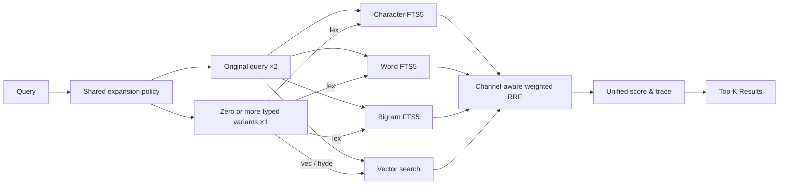
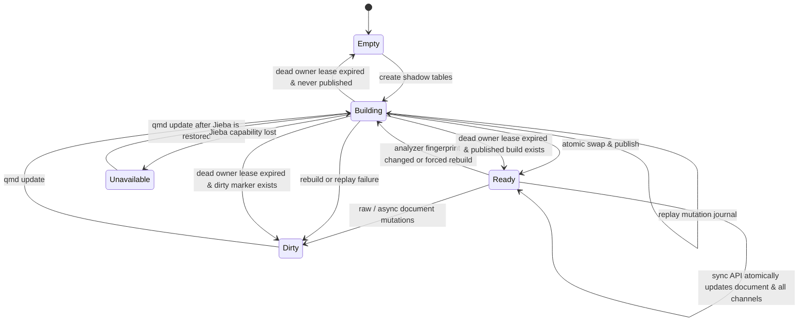
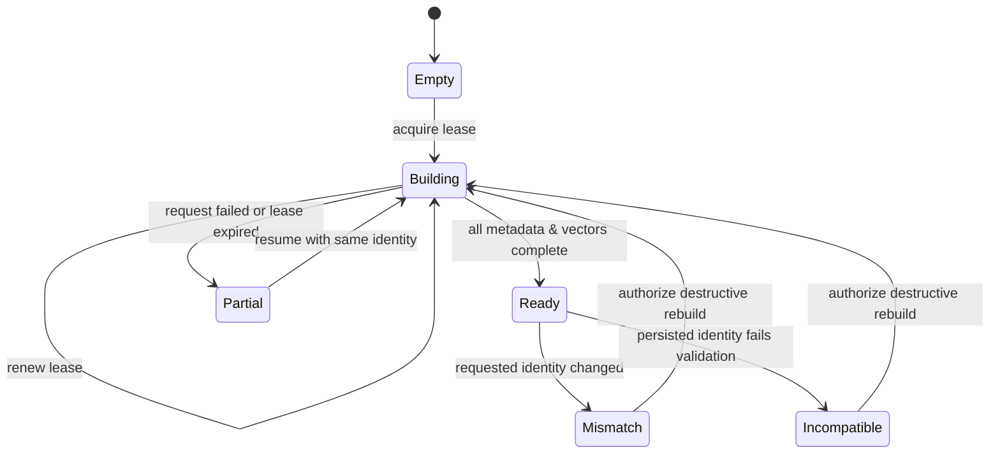
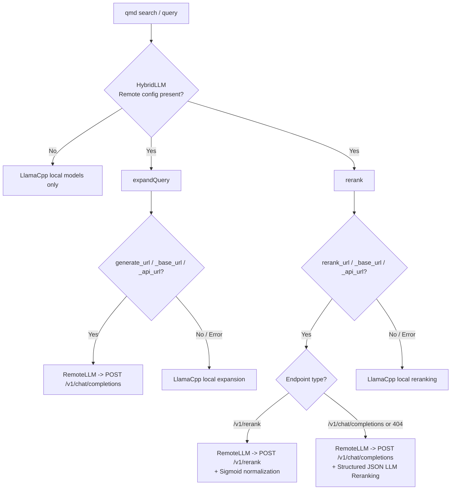

# QMD CJK Search and Remote Provider Architecture

This document explains QMD's CJK lexical search pipeline, embedding identity state machine, and data disclosure boundaries for remote embedding providers. It describes the current implementation rather than a future proposal.

## Search Data Flow

- Character, word, and bigram tables are independent lexical channels; scores from different channels are never directly summed without normalization.
- Each channel ranks candidates independently before weighted Reciprocal Rank Fusion (RRF) combines them. Use `--explain` to inspect channel contributions and tie-breakers.
- The original query runs through all available lexical and vector paths, with each ranked list assigned a ×2 RRF weight multiplier.
- Query expansion produces zero or more typed variants, with each ranked list assigned a ×1 RRF weight multiplier. `lex` variants search lexical channels only; `vec` and `hyde` search vector space only.
- The shared expansion policy is used across CLI, SDK, and MCP. Callers can explicitly specify `auto`, `force`, or `skip`; selecting `skip` suppresses typed variant generation. Under `auto`, CJK queries automatically expand when a remote LLM (`generate_api_url`) is configured, and prompt rules enforce language and script consistency (e.g. Traditional Chinese queries produce Traditional Chinese variations).
- Remote LLM Reranking supports both dedicated Cross-Encoder endpoints (`/v1/rerank`) and general LLM Chat Completions endpoints (`/v1/chat/completions`). For Chat Completions reranking, QMD uses prompt-tail Recency Enforcement, codeblock stripping, duplicate filtering, float clamping `[0.0, 1.0]`, and automatic fallback to guarantee system resilience with any remote LLM.
- If Jieba or published word/bigram indexes are unavailable, search degrades gracefully to the character channel only. Word and bigram channels remain marked unavailable until a successful rebuild. Diagnostics report `unavailable` or `stale` states alongside actionable remediation instructions rather than silently failing or pretending to be complete.

## CJK Index Publishing

Healthy published indexes update character, word, and bigram channels within a single transaction during synchronous document mutations, maintaining the `Ready` state. Raw SQL mutations bypassing the synchronous API write dirty markers.

Index rebuilds obtain a stable read snapshot before populating shadow tables. Document mutations occurring after the snapshot are recorded in a mutation journal and replayed prior to publication. Publication occurs atomically only when the analyzer fingerprint, source mutation head, and shadow tables are fully consistent.

When a dead owner's build lease expires, cleanup restores the state to `Ready`, `Empty`, or `Dirty` depending on existing published builds and dirty markers. `qmd status` and `qmd doctor` display current state causes and remediation commands.

The analyzer fingerprint includes:

- Analyzer version and normalization rules;
- Jieba capability status;
- Versioned Traditional Chinese technical dictionary content hash;
- Optional user custom dictionary content hash (`userDictionarySha256`);
- Token stream configuration parameters.

Changes to dictionary (built-in or custom user dictionary) or analyzer configurations invalidate existing fingerprints and trigger a diagnosable rebuild, preventing stale or semantically incompatible indexes from remaining active.

## Embedding Identity & Single-Dimension Restriction

The `vectors_vec` table holds vectors of a single dimension at any given time. Embedding identity fingerprints are derived from canonical materials: provider name, model identifier, dimension, remote/local mode, and prompt/chunking profiles.

Identity incompatibilities require clearing embedding metadata and vector tables prior to rebuilding; lexical search indexes remain available and unaffected.

Build leases use owner IDs and generation sequence numbers to prevent concurrent writer collisions. Interrupted builds with matching identities retain successfully committed chunks and resume by requesting only metadata-only, vector-only, missing, or layout-incomplete chunks. Vector search queries only `ready` vectors with compatible fingerprints.

## Remote Embedding

Remote embedding providers are selected explicitly through `index.yml`; local providers remain the default. `qmd embed` sends deterministic UTF-8 document chunks to the configured provider. `qmd embed --force` resets vectors when an embedding identity changes.

API keys are read strictly from process environment variables and are never stored in SQLite, diagnostics, log output, or error messages. Remote API errors expose only allowlisted status codes and messages, redacting response bodies, request payloads, credentials, and sensitive URLs. Embedding identity and build leases are revalidated within SQLite write locks before clearing or publishing vectors.

Document indexing transmits deterministic UTF-8 chunks to the remote provider; vector and hybrid search queries transmit formatted query text to the same provider. Destructive identity resets cannot be rolled back once old vectors are purged, though lexical search indexes remain operational throughout.

## Diagnostics

`qmd status`, `qmd doctor`, SDK `getStatus()`, and MCP `status` share a unified, read-only diagnostics model providing:

- Provider, model, dimension, short fingerprint, and API key configuration status (as boolean flags only);
- Embedding state, lease details, and pending/inconsistent chunk counts;
- Jieba capability status, analyzer fingerprint, channel readiness (`char`/`word`/`bigram`), and dirty/rebuild reasons;
- Corresponding actionable remediation commands.

Diagnostics operations do not create schemas, modify SQLite databases, load local LLM models, or issue remote HTTP requests.

## Remote LLM Query Expansion & Dual Reranking

- **Per-operation Routing (`HybridLLM`)**: Operation routing for query expansion and reranking is completely decoupled. Callers can specify remote endpoints for expansion, reranking, or both while keeping embedding local.
- **Smart Endpoint & Alias Resolution**: Supports `_url`, `_base_url`, and `_api_url` aliases. Given a Base URL (e.g. `https://.../v1`), RemoteLLM automatically appends `/chat/completions` or `/rerank`. Explicit endpoint URLs (ending in `/chat/completions` or `/rerank`) are preserved as-is.
- **CJK Auto-Expansion with Remote LLM**: Under `auto` mode, CJK queries skip local 1.7B expansion (0ms bypass) to avoid low-quality English translation output, but automatically expand when a remote LLM is configured.
- **Graceful Local Fallback**: When remote endpoints emit errors or fail network connections, per-endpoint circuit breakers trip and operations gracefully fall back to local `LlamaCpp` models without interrupting search queries.
- **Dual Reranking Support**: `RemoteLLM` supports both dedicated Cross-Encoder endpoints (`/v1/rerank`) and general LLM endpoints (`/v1/chat/completions`). When `/v1/rerank` receives an HTTP 404 response, it automatically switches to structured LLM Chat Completions reranking.
- **Sigmoid Score Normalization**: Reranker outputs emitting raw log-odds scores are automatically normalized using sigmoid $\sigma(x) = \frac{1}{1 + e^{-x}}$ to standard $0 \dots 1$ bounds for rank fusion.
