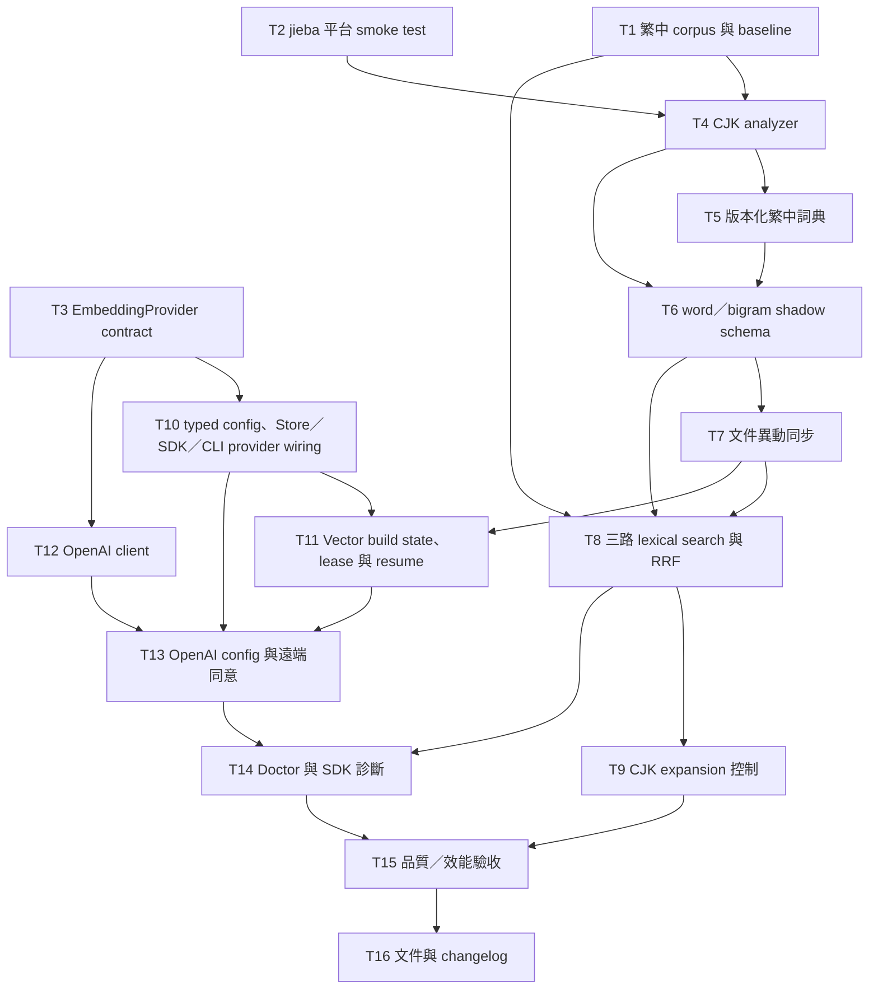

# 實作計畫：qmd 繁體中文搜尋與 OpenAI Embedding Provider

- 建立日期：2026-07-23
- 規格來源：`~/productivity/projects/ai/qmd-cjk-openai.md`
- 狀態：T1–T16 與 Checkpoint D 已完成；已獲授權由 `feat/cjk-openai-embeddings` commit／push，PR target為 `local`（外部執行結果以Git／Gitea為準）
- 修訂紀錄：2026-07-23 依社群 PR #705 的 source／discussion 稽核補強 remote capability probe、fail-fast 與 metadata/vector crash recovery；未擴張已核准範圍
- 實作範圍：qmd TypeScript repository

## 1. 概述

本計畫將兩項彼此獨立、但共同進入 hybrid search pipeline 的能力拆成可驗證的小任務：

1. 在保留既有字元級 CJK FTS 的前提下，加入 jieba 詞彙 token 與 CJK bigram，建立三組 lexical candidate list，再用 RRF 融合。
2. 將 embedding 從 `ILLMSession` 拆成獨立 provider seam，保留 local 預設，並加入明確 opt-in 的 OpenAI `text-embedding-3-small` provider。

規劃與審查階段只建立文件；實作必須經人工核准。驗證只使用 mock OpenAI，不呼叫真實 remote API、不外傳私人 corpus，也不自動執行 `qmd collection add`、`qmd update` 或 `qmd embed`。

## 2. 已確認的架構決策

- Local-first：既有 local embedding 行為是預設與相容基準。
- 遠端邊界：只有文件與查詢 embedding 可交給 OpenAI；query expansion 與 reranking 維持 local。
- OpenAI v1 固定 `text-embedding-3-small`、1536 維、128 inputs/batch、concurrency 1。
- `OPENAI_API_KEY` 只從環境變數讀取，不寫入 YAML、SQLite、log、diagnostics、snapshot、nested errors 或 request traces。
- Embedding provider／model／dimension／format 改變時，必須完整重建全域向量。
- CJK lexical search 保留 `documents_fts`，新增 word 與 bigram FTS5 table；三組結果用 RRF 融合。
- Index 與 query 共用同一 analyzer；字典版本與內容雜湊納入 analyzer fingerprint。
- Analyzer 依換行與句末標點做 deterministic segment-level script gating；含 Kana／Hangul 的 segment 不產生 jieba word tokens，只使用 char／bigram。
- 含 CJK 的 plain query 預設跳過 LLM expansion；使用者可明確以 `--expand` 啟用。
- 新 FTS table 採 stable snapshot＋mutation journal／dirty marker 追平 writer 後才原子發布；無法證明 mutation-consistent 的 build 不得成為 live index。
- CLI／SDK 共用 two-phase remote consent；MCP 只能讀 preflight/status，不能建立 acknowledgement，search API 不提供 per-call bypass。
- Consent preflight／status 必須完全 side-effect free；只有 durable acknowledgement 建立後，才可用固定且不含使用者內容的 sentinel 執行 capability probe，且 identity rebuild 必須在 probe 成功並重驗狀態後才清除舊向量。
- Remote retry budget 耗盡後必須中止當次 operation，保留已 commit chunks；禁止 batch 失敗後 fan-out 成逐筆 request，也禁止 runtime fallback 到 local provider。

## 3. 現況接點

| 子系統 | 現有接點 | 計畫中的改變 |
| --- | --- | --- |
| 設定 | `src/collections.ts` 的 `CollectionConfig.models` | 新增 typed `embedding` block，保留 `models.embed` |
| Local LLM | `src/llm.ts` 的 `ILLMSession.embed()`／`embedBatch()` | 抽出 provider contract，以 local adapter 保持相容 |
| Internal Store factory | `src/store.ts:createStore(dbPath)` | 保持 DB factory；由 composition root 注入 per-store provider identity 與 ownership |
| SDK 組裝 | `src/index.ts:createStore(StoreOptions)`，包裝 internal factory | 一次解析 per-store immutable canonical config，建立 local 或 OpenAI provider |
| Embedding pipeline | `src/store.ts:generateEmbeddings()` | 改依賴 provider、provider-qualified fingerprint 與可續跑 partial state |
| Vector query | `src/store.ts:searchVec()`／`getEmbedding()`，仍接受 legacy `ILLMSession`／`precomputedEmbedding` | 將所有實際 embed 收斂到同一 provider；保留已提供 embedding 的無網路路徑 |
| CJK fallback | `src/store.ts:normalizeCjkForFTS()` | 保留，不取代 |
| FTS migration | `src/store.ts:rebuildFTSForCjkNormalization()` | 延續 streaming／shadow build 模式建立新索引 |
| FTS search | `src/store.ts:searchFTS()` | 對 CJK 取得 char／word／bigram lists，再做 RRF |
| Query orchestration | `src/store.ts:hybridQuery()` | CJK 預設 bypass expansion，支援 explicit override |
| CLI | `src/cli/qmd.ts` | `--allow-remote`、`--expand`、provider 診斷與提示 |
| MCP | `src/mcp/server.ts`，透過 SDK store 並有獨立 input schema | 支援 expansion override 與 remote status/preflight；不得建立 acknowledgement |
| 品質評估 | `src/bench/`、`test/eval-*` | 新增繁中 corpus、fixture 與 merge gate |

### 3.1 Codegraph 審查後的校正

2026-07-23 以 repository-local Codegraph index（92 files、2,072 nodes、7,086 edges）追蹤實際 call path 後，確認實作時必須遵守以下現況，而不能只依原始架構假設：

- CLI 與 SDK 是兩個 composition root：CLI 的 `getStore()` 使用 internal store 加 global `LlamaCpp`，SDK `createStore()` 則建立 per-store `LlamaCpp`；provider wiring 必須同時覆蓋兩者。
- `src/index.ts:createStore(StoreOptions)` 是 public SDK composition root，`src/store.ts:createStore(dbPath)` 是 internal DB factory；同名 symbol 不得混用。
- CLI `getStore()` 目前以 broad catch 吞掉所有 config error；實作後只能容忍設定檔不存在，invalid config、缺 key 與 identity mismatch 必須 fail closed。
- SDK `setConfigSource()` 使用 module-global state；embedding canonical config 必須在 `createStore()` 時解析並封裝為 per-store immutable state，並以 concurrent multi-store test 證明 provider identity／consent 不交叉污染。
- `hybridQuery()` 目前直接呼叫 `LlamaCpp.embedBatch()`，並非所有 embedding 都經 `ILLMSession`／`searchVec()`；provider seam 必須涵蓋 batch query embedding，不能只改 `generateEmbeddings()`。
- Internal `Store.searchVec()` 仍接受 legacy `ILLMSession` 與 `precomputedEmbedding`；provider refactor 必須保留 precomputed 無網路路徑，並移除或封裝 session-specific embedding path。
- 向量 metadata 與向量本體分別位於 `content_vectors`、`vectors_vec`；partial resume 必須維持兩張 table 的 per-chunk 原子性，不能只停止刪除 incomplete rows。
- `searchFTS()` 的 normalized score 會參與 `STRONG_SIGNAL_MIN_SCORE`／gap 判斷；改成三路 RRF 後必須保留或重新校準這個 contract。
- SDK `SearchOptions` 與 MCP search schema 目前都沒有 explicit expansion override；只新增 CLI flag 無法達成三入口一致。
- 現有 benchmark 只有一般 `recall`、`recall_at_1/3/5`、無截斷名稱的 `mrr` 與單次 latency；要宣稱 `Recall@10`、`MRR@10`、P95 前，必須先擴充 scoring／aggregation。

## 4. 依賴關係

執行規則：

- T1、T2、T3 可平行，但必須先通過 Checkpoint A 的人工 review、targeted tests 與 typecheck，才能開始 T4、T10 或 T12。
- T4／T5 與 T12 可在檔案邊界互不重疊時平行。
- `src/store.ts`、`src/index.ts`、`src/cli/qmd.ts` 與 MCP schema 是 shared integration files；同一時間只能有一個 task 擁有並修改相關檔案。其他 task 只能處理獨立 module、test fixture 或文件，不得以可自動 merge 為假設。
- T2–T9 屬於 CJK lexical stream；T3、T10–T14 屬於 embedding provider stream。T15、T16 必須等待兩條 stream 都完成。

## 5. 任務明細

### T1：擴充 benchmark metrics，建立繁體中文 corpus 與 char baseline

**說明：** 先補齊 benchmark harness 缺少的 `Recall@10`、`MRR@10` 與 percentile latency，再固定目前字元級 FTS 的可重現結果，避免以現有 `recall`／`mrr` 欄位誤稱 top-10 指標。Corpus 要涵蓋台灣技術詞、共享字元造成的誤命中、中英混合、未知名稱與非 CJK regression。

**驗收條件：**

- [x] 新增至少 30 筆具有 stable query ID、query、完整 `relevant_doc_ids`、`must_not_match_doc_ids` 與 scenario tags 的 qrels；corpus 使用不依賴暫時路徑或 content hash 的 stable document ID，並涵蓋共享字元、台灣技術詞、中英混合、未知名稱與 non-CJK regression。
- [x] Scoring 明確新增 top-10 截斷的 `recall_at_10`、`mrr_at_10`；保留既有欄位，避免破壞現有 fixture/output consumer。
- [x] 使用固定的 5 次 warmup＋50 次 measured lexical run，將 char baseline 的 `Recall@10`、`MRR@10`、shared-character `false_positive_count`、corpus hash、scoring schema、qmd commit 與 runtime metadata 保存為 versioned JSON；P50/P95 只作同機 observation。Corpus／schema 改變時必須產生待人工核准的新 baseline，不得原地靜默覆寫。

**驗證：**

- [x] `pnpm test:node test/bench-score.test.ts test/eval-cjk.test.ts`
- [x] `pnpm run test:bun -- test/bench-score.test.ts test/eval-cjk.test.ts`
- [x] 使用 throwaway DB 的測試能重現 baseline；不讀取使用者的 `~/.cache/qmd/index.sqlite`。

**相依：** 無。

**可能異動檔案：**

- `test/eval-cjk.test.ts`
- `test/eval-cjk-docs/*.md`
- `src/bench/fixtures/cjk-zh-tw.json`
- `src/bench/fixtures/cjk-zh-tw-baseline.json`
- `src/bench/score.ts`
- `src/bench/types.ts`
- `src/bench/bench.ts`

**規模：** L。

---

### T2：驗證 `@node-rs/jieba` 的 runtime 與 package 相容性

**說明：** 在正式設計 analyzer 前先處理最高風險的 native dependency。確認目前支援的 Node 22+、Bun 與 package smoke 流程，並鎖定 API 形狀。

**驗收條件：**

- [x] 只以 `bun add @node-rs/jieba@2.0.1` 加入頂層 production dependency；不得把 `@node-rs/jieba-<platform>` 套件列為 direct dependency，並驗證 lockfile／packed install 會保留 package 自己的 optional platform selection。
- [x] 新增最小 lazy capability loader；Node 與 Bun 都能載入套件並切出固定 golden tokens，強制 native module unavailable 時只回傳 sanitized capability diagnostic 與可操作修復方向，不在 T2 提前實作 analyzer。
- [x] 從 packed tarball 在乾淨環境執行 Node/Bun smoke；最低 CI matrix 為 Linux x64 glibc、macOS x64、macOS arm64，其他 OS／architecture 只有加入 runner 並通過相同測試後才宣稱支援。

**驗證：**

- [x] `pnpm test:node test/jieba-smoke.test.ts`
- [x] `pnpm run test:bun -- test/jieba-smoke.test.ts`
- [x] `pnpm run test:package`

**相依：** 無。

**可能異動檔案：**

- `package.json`
- `bun.lock`
- `src/search/jieba-loader.ts`
- `test/jieba-smoke.test.ts`
- `scripts/package-smoke.mjs`
- `.github/workflows/ci.yml`

**規模：** M。

---

### T3：定義 `EmbeddingProvider` contract 與 local adapter

**說明：** 建立最小 provider 介面，只涵蓋 embedding 需要的能力；不要把 expansion、reranking 或通用 LLM abstraction 一併搬入。

**驗收條件：**

- [x] Contract 提供 canonical identity material、model、dimension、remote capability、query/document formatting、`embed()`、`embedBatch()`、optional `estimateTokens()`、每次操作的 `AbortSignal`／deadline 與 idempotent `close()`；成功的單筆結果必為 finite vector，batch 必須維持輸入順序與 cardinality，失敗以 typed error/result 表達而非 `null` 或缺項。
- [x] `LocalEmbeddingProvider` 共用現有 per-store／global `LlamaCpp` owner；borrowed adapter 的 `close()` 不 dispose 外部 owner，provider 自有資源才由自身 abort/dispose。Query/document formatting 與向量結果保持一致，完整 persistence fingerprint 由後續 persistence layer 對 canonical identity material 產生。
- [x] T3 只建立 contract、local adapter、ownership/lifecycle tests 與所有 `llm.embed*()` call-site inventory，不修改 Store／CLI／SDK composition roots；既有 expansion／rerank 生命週期不變，所有 embedding path 的實際切換與旁路移除留給 T10。

**Call-site inventory：** `tasks/embedding-call-site-inventory.md`

**驗證：**

- [x] `pnpm test:node test/embedding-provider.test.ts test/llm.test.ts`
- [x] `pnpm run test:bun -- test/embedding-provider.test.ts test/llm.test.ts`
- [x] `pnpm run test:types`

**相依：** 無。

**可能異動檔案：**

- `src/embedding/provider.ts`
- `src/embedding/local.ts`
- `src/llm.ts`
- `test/embedding-provider.test.ts`

**規模：** M。

---

### T4：建立共用 CJK analyzer

**說明：** 把文件與 query 共用的分析邏輯移到獨立 module，輸出 char、word、bigram 三種訊號。既有 `normalizeCjkForFTS()` 的行為需保持可回歸測試。

**驗收條件：**

- [x] 同一 input 在 index 與 query path 使用相同 deterministic segmenter 與 token serialization；依換行／句末標點切段，含 Han 且不含 Kana／Hangul 的 segment 才產生 jieba words，char／bigram 永遠可用。
- [x] Han、Latin、數字、標點與中英混合文字有固定 golden rules；不做 NFKC、跨海峽詞彙替換或其他語意正規化，embedding input 完全不經 analyzer 改寫。
- [x] 未知名稱仍能透過 bigram／char 召回；jieba loader 失敗時 analyzer 回傳 sanitized unavailable capability 與 char／bigram-only token stream，既有 Latin／char FTS regression tests 不變。Store 對 stale word/bigram 的 gating 留到 T8。

**驗證：**

- [x] `pnpm test:node test/cjk-analyzer.test.ts test/cjk-analyzer-unavailable.test.ts test/store-cjk-fts.test.ts`
- [x] `pnpm run test:bun -- test/cjk-analyzer.test.ts test/cjk-analyzer-unavailable.test.ts test/store-cjk-fts.test.ts`

**相依：** T1、T2。

**可能異動檔案：**

- `src/search/cjk-analyzer.ts`
- `test/cjk-analyzer.test.ts`
- `test/cjk-analyzer-unavailable.test.ts`
- `test/store-cjk-fts.test.ts`

**規模：** M。

---

### T5：建立 qmd 版本化繁中技術詞典

**說明：** 從固定 commit 的 zhtw-mcp 候選資料抽取後人工審查，產出 qmd 自己的小型詞典；不建立 runtime network dependency。

**驗收條件：**

- [x] Source manifest 固定 zhtw-mcp repo、commit `2e0f4e4912a8ffdacf7fa3a155cb20c29cba043b`、path、Git blob SHA `f0a4b271b2d34725517b5626bede1192951abdcf`、SHA-256 `2d43bf2f84a0a842911b216dc61b63d1f194509f396c64dc11a56748de9b657a` 與 MIT license；reviewed candidates 保存 upstream from/to/domain、accept/reject 與理由，production dictionary 只由 reviewed input deterministic 產生。
- [x] Refresh script 只能由人員明確執行：下載 pinned ruleset、驗證雙重 hash 並產生 candidate diff；build/install/runtime 不得連網。保留 zhtw-mcp MIT attribution 並讓 notice 進入 npm tarball，拒絕未審查地複製完整 ruleset。
- [x] Golden test 鎖定台灣用語與技術詞的分詞結果，package smoke 從 packed tarball 載入 production dictionary。

**驗證：**

- [x] `pnpm test:node test/cjk-dictionary.test.ts test/cjk-analyzer.test.ts`
- [x] `pnpm run test:bun -- test/cjk-dictionary.test.ts test/cjk-analyzer.test.ts`
- [x] Generator 重跑後 `git diff --exit-code` 不產生差異。

**相依：** T4。

**可能異動檔案：**

- `src/search/zh-tw-tech-dictionary.ts`
- `data/zh-tw-tech-dictionary.meta.json`
- `data/zh-tw-tech-dictionary.reviewed.json`
- `scripts/build-zh-tw-dictionary.mjs`
- `scripts/refresh-zhtw-candidates.mjs`
- `test/cjk-dictionary.test.ts`
- `THIRD_PARTY_NOTICES.md`
- `package.json`
- `scripts/package-smoke.mjs`

**規模：** M。

---

### T6：新增 word／bigram FTS shadow schema 與 analyzer fingerprint

**說明：** 保留 `documents_fts`，新增 `documents_fts_words`、`documents_fts_bigrams`。Rebuild 固定採 stable read snapshot＋monotonic mutation journal/catch-up；禁止長時間持有 writer lock 掃描全庫，也不能直接照搬現有「lock 外掃描、最後覆蓋 live table」流程。

**驗收條件：**

- [x] 新舊 DB 首次開啟時安全建立兩張新 table，三張 lexical table 共用 `documents.id` rowid 與 filepath/title/body identity；既有 `documents_fts` 保持 `porter unicode61`，預先切詞的 word/bigram tables 使用 `unicode61` 而不再套 Porter。
- [x] Build registry 保存 unique build ID、base mutation sequence、lease 與 analyzer fingerprint；dedicated stable snapshot 完成後，在短 `BEGIN IMMEDIATE` 內 replay journal 至 generation 追平、驗證 active row IDs/count，再原子發布 live tables、ready state 與 fingerprint。Fingerprint 顯式包含 segment-boundary、script-gating、bigram algorithm、jieba version 與 dictionary version/hash。
- [x] Insert/update/deactivate 交錯、crash、concurrent open 或 jieba 分析失敗都不發布 partial／空索引；重啟只清除 lease 已失效且 owner 不存在的 shadow，不能盲刪其他 process 的 active build，char table 始終可讀且錯誤狀態可診斷。

**驗證：**

- [x] `pnpm test:node test/store-cjk-word-index.test.ts test/store-cjk-rebuild-race.test.ts test/store-concurrency.test.ts`
- [x] `pnpm run test:bun -- test/store-cjk-word-index.test.ts test/store-cjk-rebuild-race.test.ts test/store-concurrency.test.ts`

**相依：** T4、T5。

**可能異動檔案：**

- `src/store.ts`
- `src/search/cjk-analyzer.ts`
- `test/store-cjk-word-index.test.ts`
- `test/store-cjk-rebuild-race.test.ts`
- `test/store-concurrency.test.ts`

**規模：** L。

---

### T7：同步文件新增、更新、停用與路徑 migration

**說明：** 所有 document mutation path 必須一致更新三張 FTS table。不要依賴 SQLite trigger 呼叫 jieba；需要在 TypeScript mutation helper 中完成 analyzed index write。Codegraph 顯示 `removeCollection()`／`renameCollection()` 會直接 `DELETE`／`UPDATE documents`，也必須納入，不只單文件 helper。

**驗收條件：**

- [x] Shared mutation transaction helper 涵蓋 `insertDocument()`、`updateDocument()`、`updateDocumentTitle()`、legacy path migration、deactivate、inactive-row cleanup、`removeCollection()` 與 `renameCollection()`；SQLite documents/content/store_collections、三張 FTS 與 mutation journal 要一起 commit/rollback。
- [x] 任一 mutation 成功後 char／word／bigram 都是同一 generation；analyzer/constraint/injected crash 失敗時整筆 rollback，並以 rename/remove/hard-delete interleaving 測試證明 journal 可 replay 到 publish 時最新狀態。
- [x] SQLite trigger 對繞過 helper 的 raw document write維持 char 最低同步、移除對應 word/bigram row、append journal 並設定 analyzer dirty；search/open 遇到 dirty／fingerprint mismatch 只能 char fallback 並提供 remediation。YAML 無法參與 SQLite transaction，CLI 必須在 mutation 後執行 idempotent `resyncConfig()`，啟動／doctor 能診斷 YAML 與 `store_collections` mismatch；手動改 DB 仍為 unsupported。

**驗證：**

- [x] `pnpm test:node test/store-cjk-word-index.test.ts test/store-cjk-mutations.test.ts test/store.test.ts`
- [x] `pnpm run test:bun -- test/store-cjk-word-index.test.ts test/store-cjk-mutations.test.ts test/store.test.ts`

**相依：** T6。

**可能異動檔案：**

- `src/store.ts`
- `src/cli/qmd.ts`
- `test/store-cjk-word-index.test.ts`
- `test/store-cjk-mutations.test.ts`
- `test/store.test.ts`

**規模：** L。

---

### T8：實作 CJK 三路 lexical retrieval 與 RRF

**說明：** CJK query 分別查 char、word、bigram FTS；非 CJK query 保持現有單一路徑。三路 BM25 不直接比數值，改以既有 RRF primitive 融合。

**驗收條件：**

- [x] CJK query 對可用且有 token 的 char/word/bigram channels 各取獨立 candidate list，以 versioned `k`／weights／candidate-depth constants 做 lexical-specific RRF 排序並按 filepath 去重、保留 collection filter；unavailable、dirty、fingerprint mismatch 或空 token channel 必須省略並留下 reason，不能執行空 MATCH。
- [x] `SearchResult.source` 維持 `"fts"`，公開 `score` 保留 `[0,1)` backend-strength 語意並取各 channel 最高 normalized BM25；RRF 只寫 internal `fusionScore` 決定排序。`minScore` 在融合後仍依公開 score 過濾，nested trace 保留各路 BM25、rank、RRF contribution 與 fusionScore，且不改既有 hybrid RRF contract。
- [x] `searchLex()`、CLI、structured `lex:` 與 hybrid 使用同一路徑；strong-signal 不讀低量級 fusionScore，而由各 channel normalized BM25 top score/gap 的 versioned policy 決定，並以 corpus regression 固定 constants 與行為，v1 不暴露 runtime tuning knobs。

**驗證：**

- [x] `pnpm test:node test/store-cjk-search.test.ts test/structured-search.test.ts test/sdk.test.ts`
- [x] `pnpm run test:bun -- test/store-cjk-search.test.ts test/structured-search.test.ts test/sdk.test.ts`
- [x] T1 corpus 的 `Recall@10`／`MRR@10` 不低於 char baseline。

**相依：** T1、T6、T7。

**可能異動檔案：**

- `src/store.ts`
- `src/search/cjk-analyzer.ts`
- `test/store-cjk-search.test.ts`
- `test/structured-search.test.ts`
- `test/sdk.test.ts`
- `test/rrf-trace.test.ts`

**規模：** M。

---

### T9：CJK 預設 bypass expansion，加入 explicit `--expand`

**說明：** 將 expansion decision 建模為 shared `auto | force | skip` policy，而不是只改 CLI boolean；CLI、SDK 與 MCP 都映射到同一 contract。CLI 現有 `expand:` parser 會回傳 `null` 卻把未剝除 prefix 的原字串交回 implicit expansion path，本任務一併修正。

**驗收條件：**

- [x] Shared policy precedence 固定為 explicit `skip`／`lex:` → skip，explicit `force`／`expand:`／`--expand` → expand，`auto`＋CJK → skip，`auto`＋non-CJK strong signal → skip，其餘 auto → expand；force 必須覆寫 CJK default 與 strong-signal bypass。
- [x] CLI prefix 先剝除再做 CJK detection/search；`lex:` 與 force 同時出現報 conflict。SDK/MCP 使用同一 `auto | force | skip` contract；explicit force 遇到 expansion model unavailable 時明確失敗，不能靜默退回 unexpanded query。
- [x] 所有模式保留 original lexical/vector retrieval；hook／explain 能區分 `cjk-default`、`strong-signal`、`explicit-skip`、`explicit-force` 與 conflict/error，並以 prefix stripping、mixed-script、single-Han 與 precedence tests 固定。

**驗證：**

- [x] `pnpm exec vitest run --reporter=verbose --testTimeout 60000 test/cjk-query-expansion.test.ts test/structured-search.test.ts test/mcp.test.ts test/sdk.test.ts`
- [x] `bun test --timeout 60000 --preload ./src/test-preload.ts test/cjk-query-expansion.test.ts test/structured-search.test.ts test/mcp.test.ts test/sdk.test.ts`

**相依：** T8。

**可能異動檔案：**

- `src/store.ts`
- `src/cli/qmd.ts`
- `src/index.ts`
- `src/mcp/server.ts`
- `test/cjk-query-expansion.test.ts`
- `test/structured-search.test.ts`
- `test/mcp.test.ts`
- `test/sdk.test.ts`

**規模：** M。

---

### T10：加入 typed embedding config，讓 Store／SDK／CLI 使用 provider seam

**說明：** 先一次完成向後相容的完整 `embedding` schema／resolver（含 OpenAI 值的驗證，但不啟用 remote request），再讓 `generateEmbeddings()`、`searchVec()`、`hybridQuery()` batch embedding、SDK `createStore()` 與 CLI `getStore()` 都改用注入的 `EmbeddingProvider`。Store 只借用 provider；CLI／SDK composition root 各自持有並關閉 provider owner。

**驗收條件：**

- [x] Resolver precedence 固定為 explicit SDK inline/configPath 或 CLI YAML 的新 `embedding` block → legacy `models.embed`（只映射 local）→ DB canonical non-secret config → local defaults；較高來源存在但無效時立即失敗，不得 fallback。Local 保留既有 override；OpenAI per-call override 只允許 canonical model 同值，其他值拒絕。DB 恢復 OpenAI config但缺 `OPENAI_API_KEY` 時 lexical/status 可開啟，remote request fail closed；T13 前 remote provider 一律 disabled。
- [x] Resolver 在 factory 建立時產生 per-store immutable canonical config，不在 operation 中重讀 module-global `configSource`；兩個 concurrent SDK stores 使用不同 inline configs 時互不污染。文件 embedding、`searchVec()` 與 `hybridQuery()` batch query embedding 使用同一 provider identity/fingerprint，所有 Store／CLI／SDK call path 都移除 direct `llm.embed*()` 旁路。
- [x] Lifecycle matrix 明確：low-level Store 不 dispose borrowed provider；CLI `closeDb()` 與 SDK `QMDStore.close()` 各自 await owner close、abort in-flight remote work，再 dispose local LLM/DB；所有 call sites await async close，double-close、close-during-retry、concurrent store isolation 與 model override 有測試。

**驗證：**

- [x] `pnpm test:node test/sdk.test.ts test/store.test.ts test/embedding-provider.test.ts`
- [x] `pnpm run test:bun -- test/sdk.test.ts test/store.test.ts test/embedding-provider.test.ts`
- [x] `pnpm run test:types`

**相依：** T3。

**可能異動檔案：**

- `src/store.ts`
- `src/index.ts`
- `src/collections.ts`
- `src/cli/qmd.ts`
- `src/embedding/provider.ts`
- `src/embedding/local.ts`
- `test/sdk.test.ts`
- `test/store.test.ts`
- `test/collections-config.test.ts`

**規模：** L。

---

### T11：實作 provider-qualified fingerprint 與 partial resume

**說明：** 目前 `generateEmbeddings()` 每次會呼叫 `removeIncompleteEmbeddings()`，刪除同一文件已成功的 partial chunks，直接違反續跑需求；而 `content_vectors` 與 `vectors_vec` 又是分離的 metadata/vector tables。本任務必須移除這條 destructive resume path，以逐 chunk pending scan、雙表原子寫入與 targeted inconsistency repair 取代，同時阻止不同 identity 混入單一 `vectors_vec`。

**驗收條件：**

- [x] Persistence layer只提供全域reset transaction：identity改變時禁止`--collection`，並在單一短transaction內清空metadata/vector、依新dimension重建`vectors_vec`、保存canonical identity且原子取得building lease；T13負責在呼叫reset前完成remote authorization與capability probe，T13前remote provider維持disabled。每chunk metadata insert、既有vector delete與新vector insert同一transaction；batch failure/crash保留成功chunk，重跑只送pending或targeted-repair chunk，不再呼叫destructive partial cleanup。
- [x] Canonical identity 包含 provider、model、dimension、固定 formatter sentinel/version 與 chunking parameters，持久化完整 hash且不含使用者內容；既有 6-hex fingerprint 只作 UI short code。Legacy 值只有可證明符合 local canonical identity 時遷移，否則標記 incompatible，24-bit 值永遠不能授權 remote consent。
- [x] DB 持有 authoritative `building | ready | incompatible` identity 與跨程序 lease/CAS；每次 chunk insert 重驗 identity/lease。Pending／health scan 必須雙向驗證 `content_vectors` 與 `vectors_vec`，vector search只join當前ready identity。Building 時 lexical可用但vector search unavailable；完成前在writer lock內重掃pending/inconsistent chunks並驗證T7 document generation，成功才轉ready。Ready後新增／更新文件只標pending、既有vectors保持可查；不相容時只允許全域rebuild。

**驗證：**

- [x] `pnpm test:node test/embed-resume.test.ts test/embedding-state-machine.test.ts test/store-concurrency.test.ts test/sdk.test.ts test/store.test.ts`
- [x] `pnpm run test:bun -- test/embed-resume.test.ts test/embedding-state-machine.test.ts test/store-concurrency.test.ts test/sdk.test.ts test/store.test.ts`
- [x] Fault injection 分別模擬 metadata insert 後、舊 vector delete 後、新 vector insert 前與 transaction commit 前 crash；重開 store 後不得把 metadata-only row 視為完成，只有缺少或 identity 不一致的 chunk 被重新要求，vector search不得讀取非ready identity。

**相依：** T7、T10。

**可能異動檔案：**

- `src/store.ts`
- `src/embedding/provider.ts`
- `test/embed-resume.test.ts`
- `test/store.test.ts`
- `test/embedding-fingerprint.test.ts`
- `test/embedding-state-machine.test.ts`
- `test/store-concurrency.test.ts`

**規模：** L。

---

### T12：實作 OpenAI embedding HTTP client

**說明：** 使用內建 `fetch` 實作窄版 client，不引入通用 OpenAI SDK。所有測試使用本機 mock HTTP server；禁止真正連線到 OpenAI。

**驗收條件：**

- [x] Request 固定 `model: text-embedding-3-small`、`dimensions: 1536`、`encoding_format: float`、每批最多 128 inputs、concurrency 1；以 UTF-8 byte count 作保守 token upper bound，拒絕 empty input、單筆超過 8,192 或整批超過 300,000，並依 response index 還原順序。Estimate 明標 upper bound，成功後以 response usage 校對。
- [x] 429、暫時性 5xx、network error、timeout 採含 jitter 的 exponential backoff，總 attempts 不超過 3 次；`Retry-After` 支援 seconds／HTTP date且受 operation deadline/max delay 限制。Explicit abort、schema error與其他 4xx不retry；retry budget耗盡回傳typed terminal error，由operation立即中止，不在provider或Store層拆成逐筆request，也不fallback local。Clock/random/transport可注入以做無真實sleep的測試，但base URL/transport不進public config。
- [x] 嚴格驗證 response object/model/usage、data 完整性、index 唯一性與範圍、每筆 1536 個有限數值；將 native fetch error 轉為 safe domain error，遞迴清理 `message`、`stack`、`cause` 與 enumerable fields，不記錄或洩漏 key/header/input/body，actual usage 只回傳數字供 reconciliation。

**驗證：**

- [x] `pnpm test:node test/openai-embedding-provider.test.ts`
- [x] `pnpm run test:bun -- test/openai-embedding-provider.test.ts`
- [x] 測試覆蓋成功、亂序、partial、duplicate index、NaN、wrong dimension、429、5xx、timeout與abort；terminal failure以request count證明沒有batch-to-single fan-out或local fallback，oversized input在request count為零時即被拒絕。

**相依：** T3。

**可能異動檔案：**

- `src/embedding/openai.ts`
- `src/embedding/provider.ts`
- `test/openai-embedding-provider.test.ts`

**規模：** M。

---

### T13：完成 OpenAI remote policy、全域 rebuild guard 與同意流程

**說明：** 在 T10 typed config 基礎上啟用 OpenAI provider。CLI 與 SDK 共用 two-phase consent service：先取得含 full fingerprint、資料外傳說明、document generation、conservative token/cost upper bound 與 opaque preflight ID 的 preflight，再以 exact fingerprint/preflight ID 建立 durable acknowledgement。MCP 只能讀 status/preflight，不提供 acknowledgement tool。Shared provider boundary 在每次 remote request 前檢查 full fingerprint 與 typed request purpose。

**驗收條件：**

- [x] 只消費 T10 canonical resolver，不另建 config parsing；CLI `getStore()` 只容忍設定檔不存在，invalid config 整體失敗。缺 key 時 lexical/status 可開，但 remote operation fail closed且不退回 local；identity mismatch 只允許明確 rebuild。
- [x] Preflight 保存 full fingerprint、policy schema、provider/model/dimension、T7 document generation、pending count、UTF-8-byte conservative token/cost upper bound、pricing metadata version/`checkedAt` 與 opaque `preflightId`。Preflight/status 完全 side-effect free且 remote request count 為零；acknowledgement 前重驗 fingerprint/policy/generation，任一改變即要求重新 preflight。SQLite 只保存 fingerprint、policy version、acceptedAt、CLI/SDK surface，不保存文件/query/key；shared guard每次request重讀acknowledgement，未確認或設定改變時request count為零。
- [x] Provider boundary 要求 typed purpose：`capability-probe` 只在 durable acknowledgement 後使用固定、版本化且不含使用者內容的 sentinel，identity rebuild時必須在任何舊vector／metadata清除前完成並驗證canonical model/dimension/schema；probe後、reset transaction前重驗fingerprint/policy/generation與destructive rebuild authorization，再由T11 reset transaction原子取得building lease。`index-build`只有當前lease owner在building時可送；`query-embedding`只有ready、identity compatible且有可查vector rows時可送，所有本機prerequisite先於外傳。Identity改變時CLI必須同時提供`--force`與`--allow-remote`；SDK必須先acknowledgement再明確destructive rebuild，任一授權不得隱含另一個。Terminal remote failure立即中止operation、不fan-out、不fallback local，並保留不可搜尋但可續跑的building state且不宣稱可rollback。

**驗證：**

- [x] `pnpm test:node test/collections-config.test.ts test/cli-openai-embed.test.ts test/remote-consent.test.ts test/embedding-state-machine.test.ts test/sdk.test.ts test/mcp.test.ts`
- [x] `pnpm run test:bun -- test/collections-config.test.ts test/cli-openai-embed.test.ts test/remote-consent.test.ts test/embedding-state-machine.test.ts test/sdk.test.ts test/mcp.test.ts`
- [x] Mock server request count 證明未確認、缺key、fingerprint改變時都沒有資料外傳；bad credential／wrong dimension／schema failure發生在capability probe時，舊ready vectors與metadata保持不變；probe成功後若generation或identity競爭改變，reset仍必須中止。

**相依：** T10、T11、T12。

**可能異動檔案：**

- `src/cli/qmd.ts`
- `src/index.ts`
- `src/mcp/server.ts`
- `src/embedding/openai.ts`
- `src/embedding/estimate.ts`
- `src/embedding/consent.ts`
- `test/collections-config.test.ts`
- `test/cli-openai-embed.test.ts`
- `test/remote-consent.test.ts`
- `test/embedding-state-machine.test.ts`

**規模：** L。

---

### T14：補齊 `doctor`、status 與 SDK 診斷

**說明：** 讓使用者能看出目前 provider、vector identity、pending 狀態與可操作的修復指令，但不顯示 secret。CLI internal store 不能再以 `store.llm?.embedModelName ?? DEFAULT_EMBED_MODEL` 推測 identity，因為 CLI 實際使用的是 global composition root。

**驗收條件：**

- [x] 保留既有 status/SDK/MCP 欄位並 additive 新增 nested diagnostics。Embedding 顯示 provider/model/dimension、short/full fingerprint、build state/lease expiry、pending/inconsistent chunks、key-configured boolean、acknowledgement 與 pricing `checkedAt`；identity 一律取 resolved provider，不再從 `store.llm` 推測。
- [x] Lexical diagnostics 顯示 jieba capability、analyzer fingerprint、char/word/bigram readiness 與 dirty/rebuild reason；能區分 missing、stale、partial、metadata/vector inconsistency與 incompatible，並提供可操作修復指令。
- [x] `doctor`、status、SDK health、MCP status/preflight 全部 side-effect free且 remote request count 為零；secret/error/snapshot採 field allowlist，API key只顯示 boolean，不顯示 prefix/suffix/length，任何輸出都不含 key、header、input或request body。

**驗證：**

- [x] `pnpm test:node test/doctor-embedding-provider.test.ts test/sdk.test.ts test/cli.test.ts test/mcp.test.ts`
- [x] `pnpm run test:bun -- test/doctor-embedding-provider.test.ts test/sdk.test.ts test/cli.test.ts test/mcp.test.ts`
- [x] Mock transport request count 證明所有 doctor/status/preflight 路徑都沒有資料外傳。

**相依：** T8、T13。

**可能異動檔案：**

- `src/cli/qmd.ts`
- `src/index.ts`
- `src/store.ts`
- `test/doctor-embedding-provider.test.ts`
- `test/sdk.test.ts`
- `test/store.test.ts`

**規模：** M。

---

### T15：執行整合、品質、安全與效能驗收

**說明：** 兩條 stream 合併後才做 merge gate。OpenAI 比較使用 mock correctness test；真實 API benchmark 必須由使用者另行明確授權，且使用非私人 corpus。T1 新增的 percentile aggregation 才是本任務的量測來源，不得從單次 `Date.now()` latency 宣稱 P95。

**驗收條件：**

- [x] 只有 corpus hash、scoring schema與baseline version完全相符時才比較；CJK `Recall@10`／`MRR@10` 不低於 T1 char baseline，shared-character subset `false_positive_count` 不得高於 baseline。Quality regression 使 benchmark command non-zero exit；未固定門檻的改善只報告。
- [x] 所有量測使用 versioned public fixture＋temporary DB，不讀寫使用者 index，也不執行使用者層級 `qmd update/embed`。在與 T1 相同 host/runtime，以 5 warmup＋50 measured lexical runs 記錄三路 index size、cold rebuild與P50/P95；hybrid另用1 warmup＋20 runs，只報告不作跨硬體 gate。真實 OpenAI benchmark 不屬於 DoD。
- [x] 完整 test/build、frozen Bun install、packed-tarball smoke與 dependency audit通過；`bun.lock`／`pnpm-lock.yaml` 同步 direct dependency，無本變更新增的 reachable high/critical finding。Local-only、Latin、existing config、strong-signal、RRF explain、provider lifecycle、CLI／SDK／MCP無 regression。

**驗證：**

- [x] `pnpm test:node` 與 `pnpm test:bun`（分程序序列執行base及local-model groups）
- [x] `pnpm run build`
- [x] `pnpm run test:package`
- [x] `bun install --frozen-lockfile`
- [x] 執行並分級處理 dependency audit；packed tarball 重新安裝後驗證 native optional dependency 與詞典 data。
- [x] 不執行 `bun build --compile`。

**實測結果（2026-07-24，current tree）：**

> Canonical config、provider identity、read-only diagnostics與文件修補完成後，以RED→GREEN補上active scoped embedding operation的shutdown drain barrier；後續review再找出concurrent CLI cleanup、OpenAI CLI／SDK drain、ready analyzed index在Jieba unavailable時仍查詢bigram，以及session acquisition先檢查idle unload、經過microtask後才取得lease的TOCTOU缺口。default／per-Llama adversarial tests已先證明session callback可與context disposal重疊，再以atomic acquisition barrier修正為GREEN；fresh review另重現default singleton disposer在active session期間提前釋放runtime，現已將full disposal改為同步關閉admission、drain兩個manager domain並共用completion promise，並補上failed idle unload後重試full cleanup的regression。Current-tree完整gate與final5 hash-stable T16／Checkpoint D review均已通過，尚未建立commit或PR。

- Node full runtime：`pnpm test:node` exit 0，base suite與所有隔離local-model groups全數通過。
- Bun full runtime：`pnpm test:bun` exit 0，base suite與所有隔離local-model groups全數通過。
- CJK public fixture：`Recall@10 = 0.84375`、`MRR@10 = 0.828125`、shared-character false positives `= 1`，均通過 approved char baseline gate。
- `bun scripts/measure-cjk.ts`（CPU、temporary DB）：lexical 5 warmup＋50 measured，cold rebuild `30.54 ms`；logical payload bytes char/word/bigram `16,024 / 8,208 / 10,277`；hybrid 1 warmup＋20 measured，P50/P95 `34.75 / 48.50 ms`。以上皆為同機 observation，不作跨硬體 gate。
- `pnpm audit --audit-level high`：0 high/critical；剩餘 5 moderate、2 low 已分級。pnpm/Bun frozen install、packed tarball、Node/Bun packed Jieba capability與詞典data smoke均通過。
- `pnpm test:node` 與 `pnpm test:bun`：base suites及隔離的local-model family groups全數通過；`pnpm run test:quality` 8/8通過。
- Default/full-disposal drain修正、failed-idle-unload regression與typed expansion文件校正已重新通過Node／Bun base及隔離local-model groups、CJK quality、dictionary check、typecheck、build、package smoke與diff check；current-tree最終標記為 `FINAL_DISPOSAL_DRAIN_FULL_GATE_OK`。

**相依：** T9、T14。

**可能異動檔案：**

- `test/eval-cjk.test.ts`
- `src/bench/fixtures/cjk-zh-tw.json`
- `src/bench/bench.ts`
- `tasks/plan.md`（填入實測結果或連結）

**規模：** M。

---

### T16：更新使用者文件、架構與 changelog

**說明：** 只在行為通過驗收後更新正式文件。文件使用繁體中文撰寫本 fork 的設計說明，公開 CLI 說明遵循 upstream repository 現有語言與語氣。

**驗收條件：**

- [x] README／CLI help 依 upstream 英文語氣說明 local default、OpenAI opt-in、document/query 外傳、conservative estimate、獨立的 `--force`／`--allow-remote` 授權、無 vector rollback、jieba char fallback 與 `auto | force | skip` expansion precedence。
- [x] 新增繁體中文 `docs/architecture-cjk-openai.zh-TW.md`，以 Mermaid 呈現 analyzer、FTS/RRF、embedding provider、lexical/vector state machine、migration與recovery。
- [x] `CHANGELOG.md` 的 `Unreleased` 記錄 native dependency、schema migration、相容性與no-rollback warning；文件不宣稱未實測的品質優勢。

**驗證：**

- [x] `pnpm run build`
- [x] CLI help snapshot／測試通過。
- [x] 文件中的 command、config key 與實際 implementation 一致。

**相依：** T15。

**可能異動檔案：**

- `README.md`
- `CLAUDE.md`
- `CHANGELOG.md`
- `src/cli/qmd.ts`
- `docs/architecture-cjk-openai.zh-TW.md`

**規模：** M。

## 6. Checkpoints

### Checkpoint A：T1–T3

- [x] 繁中 baseline 已固定。
- [x] jieba 可在 Node/Bun/package runtime 載入。
- [x] Provider contract 經人工 review，沒有擴張成通用 LLM abstraction。
- [x] `pnpm run test:types` 通過。

### Checkpoint B：T4–T9（CJK lexical slice）

- [x] 三張 FTS table 能增量同步與 crash-safe rebuild。
- [x] CJK CLI／SDK／MCP 搜尋共用同一 analyzer 與融合路徑。
- [x] CJK 預設不 expansion，explicit override 有測試。
- [x] T1 品質門檻必須在 T15 final integration 前通過；不阻止 T10/T12 isolated work，shared integration files仍維持 single-writer。

### Checkpoint C：T10–T14（Embedding provider slice）

- [x] Local behavior 完全相容。
- [x] OpenAI 所有測試都由 mock server 驗證，沒有真實 API request。
- [x] Remote consent、full rebuild guard、partial resume、secret redaction 都通過。
- [x] Provider/config/CLI contract 已完成 adversarial review 後進入全套驗收。

### Checkpoint D：T15–T16

- [x] Node／Bun分程序完整測試、`pnpm run build`與package smoke全綠。
- [x] Benchmark 與 migration 結果有實測證據。
- [x] 文件、CLI help、config schema 與程式行為一致。
- [x] 已完成 current-tree hash-stable code review 與 scoped simplification；未執行 commit／PR。

## 7. 風險與緩解措施

| 風險 | 影響 | 緩解措施 |
| --- | --- | --- |
| `@node-rs/jieba` native binary 不支援某 target | 高 | Install/packed-tarball verification fail-fast；runtime capability失敗時只啟用char fallback並明確診斷 |
| zhtw-mcp ruleset 不適合直接分詞 | 高 | 固定 commit、抽取候選、人工審查、產出 qmd 自有小詞典 |
| 三張 FTS 增加 startup/rebuild 成本 | 中 | Stable snapshot＋streaming shadow build；量測 cold rebuild/index size，fingerprint只重建必要table |
| Shadow rebuild 與 document writer 競爭 | 高 | 固定 mutation journal/catch-up protocol與publish-time generation驗證；以update/remove/rename race test證明 |
| 三路 BM25 分數不可直接比較 | 高 | RRF只融合rank；公開score保留最高backend strength，另存fusionScore與per-channel explain |
| Trigger 無法執行 jieba | 高 | TypeScript helper同步新索引；trigger維持char、刪secondary rows、append journal並設dirty |
| Raw SQL 繞過 analyzer helper 造成 word/bigram drift | 高 | Trigger 設 dirty marker／刪舊 row；search/open 重建或 fail closed；手改 DB 明列 unsupported |
| Provider seam 演變成過度抽象 | 中 | Contract 限於 embedding；不搬 expansion/rerank；Checkpoint A 人工 review |
| `vectors_vec` 單一 dimension 被混用 | 高 | Provider-qualified fingerprint、global identity guard、不相容時只允許 full rebuild |
| Existing partial cleanup 與 resume 需求衝突 | 高 | T11 先建 crash/resume test，再改 persistence semantics；remote terminal error中止operation且不得逐筆fan-out |
| `content_vectors`／`vectors_vec` crash 後不一致 | 高 | Metadata insert／舊vector delete／新vector insert同一transaction；雙向health scan與每個statement boundary fault-injection test |
| 不同 process 同時建置不同 vector identity | 高 | DB state machine、跨程序 lease/CAS、每次 insert revalidation；query 只讀 ready identity |
| 三路 RRF 改變 `searchFTS()` score scale | 高 | Public `score`保留既有`[0,1)` backend-strength語意；fusionScore只作內部排序，`minScore` regression test固定 |
| CLI 與 SDK 使用不同 LLM composition root | 高 | T10 同時注入兩條 root；lifecycle/dispose regression tests |
| 遠端 retry 重複送出資料或失控計費 | 高 | Concurrency 1、128 inputs、8,192/300,000 budgets、3 attempts、jitter/deadline、usage reconciliation；terminal failure fail-fast且不batch-to-single fan-out |
| Secret 進入 error/snapshot | 高 | 集中 redaction、mock secret sentinel、對所有 CLI/provider error 做 negative assertion |
| Native fetch error 的 `cause`／stack 帶出 header/body | 高 | 轉 safe domain error，遞迴 sanitize error graph，禁止 raw exception 進 CLI/SDK output |
| 6-hex fingerprint 碰撞造成錯誤 consent／identity | 高 | 持久化 canonical full hash；短碼只顯示；測試 legacy migration |
| 詞典只存在 `src/`、npm tarball 遺漏 runtime data | 高 | 生成可編譯 TS module、發布 third-party notice、由 packed tarball smoke test 驗證 |
| OpenAI 價格過期或 UTF-8 token upper bound高估 | 中 | 價格表版本化並顯示checkedAt；estimate標示conservative，成功後以usage校對，不承諾精確帳單 |
| `src/store.ts` 過大且兩條 stream 都會修改 | 中 | 先固定contracts；shared integration files single-writer；每2–3個task checkpoint |
| Module-global config污染多個SDK store | 高 | Factory產生per-store immutable canonical config；concurrent multi-store isolation test |
| Preflight後文件或identity變更造成stale consent | 高 | Preflight綁fingerprint/policy/document generation/preflightId，ack前重驗 |
| `--allow-remote`與destructive reset權限混淆 | 高 | CLI要求獨立`--allow-remote`＋`--force`；SDK two-phase ack與rebuild action分離 |
| Remote設定錯誤時先清除既有ready vectors | 高 | Side-effect-free preflight後建立ack；destructive reset前用非敏感sentinel做capability probe，成功後再次重驗identity/generation/authorization，再由reset transaction原子取得lease |

## 8. 實作前決策紀錄（OQ1–OQ5 均已定案）

### OQ1：jieba 適用語言範圍（已定案）

結論：使用 deterministic segment-level script gating。Analyzer 先按換行與句末標點切段；含 Han 且不含 Hiragana、Katakana、Hangul 的 segment 才產生 jieba word tokens，Latin／數字可與 Han 共存。含 Kana／Hangul 的 segment 只產生 char/bigram；index 與 query 必須共用同一 segmenter。

### OQ2：尚未同意時的 remote query embedding（已由規格定案）

結論：任何 remote request 都必須先存在相同 full fingerprint 的 durable acknowledgement；若使用者在 `qmd embed --allow-remote` 前執行 `vsearch/query`，拒絕且 request count 為零。CLI／SDK 使用 OQ5 定案的 two-phase consent service；MCP 不能建立 acknowledgement。

### OQ3：費用估算依據（已定案）

結論：採版本化靜態價格、UTF-8 byte conservative token upper bound與事後usage校對。V1內建`text-embedding-3-small`每100萬input tokens USD 0.02，來源為OpenAI官方model page，`checkedAt: 2026-07-23`。Preflight顯示upper-bound tokens/cost、來源與查核日期，明標不等於實際帳單；成功後以API usage記錄actual tokens。價格metadata更新不改embedding fingerprint，也不撤銷acknowledgement。

### OQ4：zhtw-mcp source commit（已定案）

結論：固定 zhtw-mcp `main` 在 commit `2e0f4e4912a8ffdacf7fa3a155cb20c29cba043b`（2026-07-10，GitHub verified）。`assets/ruleset.json` 的 Git blob SHA 為 `f0a4b271b2d34725517b5626bede1192951abdcf`，SHA-256 為 `2d43bf2f84a0a842911b216dc61b63d1f194509f396c64dc11a56748de9b657a`。Source manifest 同時保存 repo、commit、path、雙重內容雜湊及 MIT attribution；production dictionary 只接受白名單抽取與人工審查，禁止整包複製 ruleset。

### OQ5：SDK／MCP 的 remote authorization API（已定案）

結論：CLI與SDK共用two-phase consent service。`getRemotePreflight()`回傳full fingerprint、policy、provider/model、document generation、資料外傳說明、pending upper-bound estimate與opaque preflight ID；`acknowledgeRemote({ fingerprint, preflightId })`重驗fingerprint/policy/generation後才持久化。MCP只提供status/preflight，不提供acknowledgement tool；search API不接受per-call bypass。

## 9. Definition of Done

- [x] 所有 task acceptance criteria 與 checkpoint 都有 current-tree 可重現證據。
- [x] 每個 task 先有失敗測試，再有最小實作，最後進行不改行為的簡化。
- [x] Node／Bun分程序完整測試、`pnpm run build`與`pnpm run test:package`通過。
- [x] 沒有執行或產生 `bun build --compile`。
- [x] 沒有真實 OpenAI request、私人 corpus 外傳或 secret 落盤。
- [x] Benchmark與rebuild只使用public fixture／temporary DB，沒有讀寫使用者index。
- [x] Dependency audit已按reachability分級，沒有本變更新增且未處理的high/critical finding。
- [x] Benchmark 證明 CJK 品質不低於 baseline；沒有無證據的優勢宣稱。
- [x] Current-tree hash-stable code review沒有blocker，migration、recovery與vector rebuild明確no-rollback warning完整。
- [x] 使用者已人工核准本計畫；Phase 0 實作與驗收已完成。
